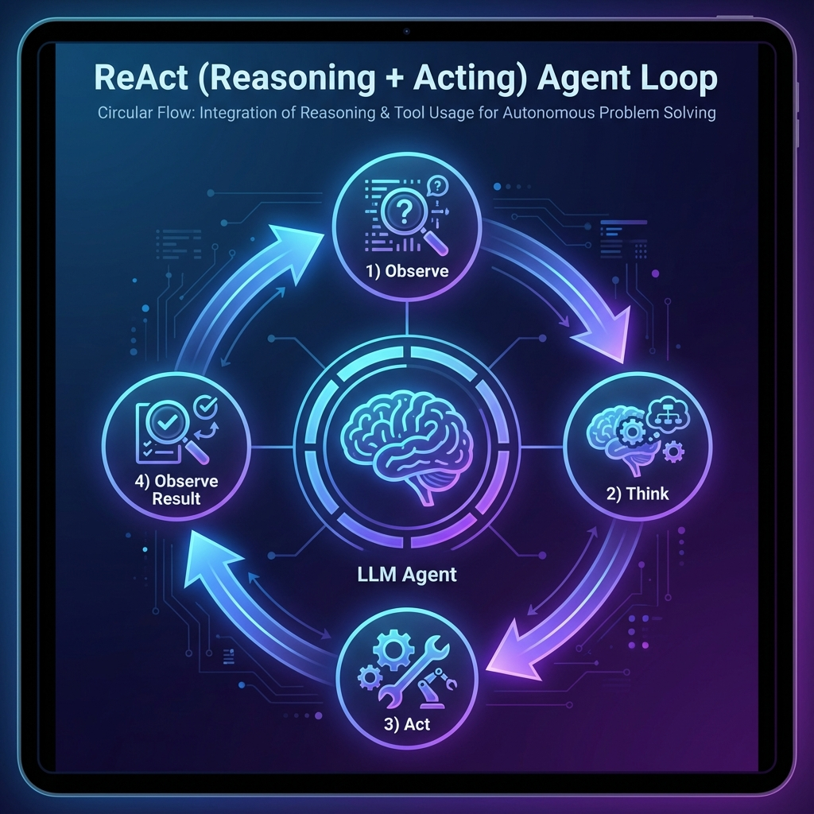

# Konsep Agents

Agent adalah AI yang tidak hanya **menjawab pertanyaan**, tapi juga bisa **mengambil aksi** menggunakan tools.

## Apa itu Agent?

Agent = **LLM sebagai "otak"** yang memutuskan kapan dan tools apa yang akan digunakan.

```
┌─────────────────────────────────────────────────────────────┐
│                          AGENT                               │
├─────────────────────────────────────────────────────────────┤
│                                                              │
│                     ┌──────────┐                            │
│     User Query ───▶ │   LLM    │ ◀───▶ Tools               │
│                     │ (Brain)  │                            │
│                     └──────────┘                            │
│                          │                                   │
│                          ▼                                   │
│                    Final Answer                              │
│                                                              │
│   Tools available:                                           │
│   🔍 Search    📊 Calculator    🌐 API    📁 Files          │
│                                                              │
└─────────────────────────────────────────────────────────────┘
```

### Chain vs Agent

| Aspek | Chain | Agent |
|-------|-------|-------|
| **Flow** | Linear, predetermined | Dynamic, LLM decides |
| **Tools** | Fixed sequence | LLM chooses which |
| **Iterations** | Fixed | Can loop until solved |
| **Complexity** | Simple | Complex reasoning |

## ReAct Pattern: Reasoning + Acting

ReAct adalah pattern paling populer untuk agents.



### ReAct Flow

```
┌─────────────────────────────────────────────────────────────┐
│                      ReAct Loop                              │
├─────────────────────────────────────────────────────────────┤
│                                                              │
│   1. THOUGHT: "Saya perlu cari info tentang X..."           │
│          │                                                   │
│          ▼                                                   │
│   2. ACTION: Panggil tool 'search' dengan query "X"         │
│          │                                                   │
│          ▼                                                   │
│   3. OBSERVATION: "Hasil search: X adalah..."               │
│          │                                                   │
│          ▼                                                   │
│   4. THOUGHT: "Sekarang saya sudah punya info, bisa jawab"  │
│          │                                                   │
│          ▼                                                   │
│   5. FINAL ANSWER: "X adalah..."                            │
│                                                              │
└─────────────────────────────────────────────────────────────┘
```

### Contoh ReAct Trace

```python
# User: "Berapa hasil 25 * 48 + 150?"

# Thought 1: Saya perlu menghitung 25 * 48 dulu
# Action: calculator(25 * 48)
# Observation: 1200

# Thought 2: Sekarang tambah 150
# Action: calculator(1200 + 150)
# Observation: 1350

# Thought 3: Sudah dapat jawabannya
# Final Answer: Hasil dari 25 * 48 + 150 adalah 1350
```

## Kapan Pakai Agent?

### ✅ Cocok untuk:

- **Kompleks reasoning** - masalah multi-step
- **Tool usage** - perlu akses external resources
- **Dynamic tasks** - tidak tahu step-nya di awal
- **Research** - gathering info dari berbagai sumber

### ❌ Kurang cocok untuk:

- **Simple Q&A** - overkill, pakai chain saja
- **Deterministic flow** - kalau sudah tahu stepnya
- **Low latency** - agent lebih lambat
- **Limited budget** - banyak LLM calls

## Agent Components

### 1. LLM (The Brain)

```python
from langchain_openai import ChatOpenAI

llm = ChatOpenAI(model="gpt-4o-mini", temperature=0)
```

### 2. Tools (The Hands)

```python
from langchain_core.tools import tool

@tool
def search(query: str) -> str:
    """Search the web for information."""
    # Implementation
    return "Search results..."

@tool  
def calculator(expression: str) -> str:
    """Calculate mathematical expressions."""
    return str(eval(expression))

tools = [search, calculator]
```

### 3. Prompt (The Instructions)

```python
from langchain_core.prompts import ChatPromptTemplate

prompt = ChatPromptTemplate.from_messages([
    ("system", """You are a helpful assistant with access to tools.
Use tools when needed to answer questions accurately.
Think step by step before acting."""),
    ("placeholder", "{chat_history}"),
    ("human", "{input}"),
    ("placeholder", "{agent_scratchpad}")
])
```

### 4. Agent Executor (The Loop)

```python
from langchain.agents import create_tool_calling_agent, AgentExecutor

# Create agent
agent = create_tool_calling_agent(llm, tools, prompt)

# Create executor (runs the loop)
agent_executor = AgentExecutor(
    agent=agent,
    tools=tools,
    verbose=True  # See the reasoning
)

# Run
result = agent_executor.invoke({"input": "What's 25 * 48 + 150?"})
```

## Simple Agent Example

```python
from dotenv import load_dotenv
from langchain_openai import ChatOpenAI
from langchain_core.tools import tool
from langchain.agents import create_tool_calling_agent, AgentExecutor
from langchain_core.prompts import ChatPromptTemplate

load_dotenv()

# Tools
@tool
def add(a: int, b: int) -> int:
    """Add two numbers together."""
    return a + b

@tool
def multiply(a: int, b: int) -> int:
    """Multiply two numbers together."""
    return a * b

tools = [add, multiply]

# LLM
llm = ChatOpenAI(model="gpt-4o-mini", temperature=0)

# Prompt
prompt = ChatPromptTemplate.from_messages([
    ("system", "You are a helpful math assistant. Use tools for calculations."),
    ("human", "{input}"),
    ("placeholder", "{agent_scratchpad}")
])

# Create agent
agent = create_tool_calling_agent(llm, tools, prompt)
executor = AgentExecutor(agent=agent, tools=tools, verbose=True)

# Run
result = executor.invoke({"input": "What is 5 + 3, then multiply that by 4?"})
print(result["output"])
```

Output dengan `verbose=True`:
```
> Entering new AgentExecutor chain...

Invoking: `add` with `{'a': 5, 'b': 3}`
8

Invoking: `multiply` with `{'a': 8, 'b': 4}`
32

The answer is 32. First, 5 + 3 = 8, then 8 × 4 = 32.

> Finished chain.
```

## Agent Architecture Types

### 1. Tool Calling Agent (Recommended)

Uses native LLM function calling.

```python
from langchain.agents import create_tool_calling_agent
```

### 2. ReAct Agent

Uses prompt-based reasoning.

```python
from langchain.agents import create_react_agent
```

### 3. Structured Chat Agent

For models without native function calling.

```python
from langchain.agents import create_structured_chat_agent
```

## Error Handling

Agents can fail - handle gracefully:

```python
executor = AgentExecutor(
    agent=agent,
    tools=tools,
    verbose=True,
    max_iterations=10,  # Prevent infinite loops
    handle_parsing_errors=True,  # Recover from errors
    return_intermediate_steps=True  # Debug info
)

try:
    result = executor.invoke({"input": query})
except Exception as e:
    print(f"Agent error: {e}")
```

## Ringkasan

1. **Agent** = LLM + Tools + Reasoning loop
2. **ReAct** = Think → Act → Observe → Repeat
3. **Components**: LLM, Tools, Prompt, Executor
4. **Good for**: Complex, dynamic, multi-step tasks
5. **Trade-off**: More powerful but slower/costlier

---

**Selanjutnya:** [Tool Calling](/docs/agents/tool-calling) - Cara LLM memilih dan memanggil tools.
