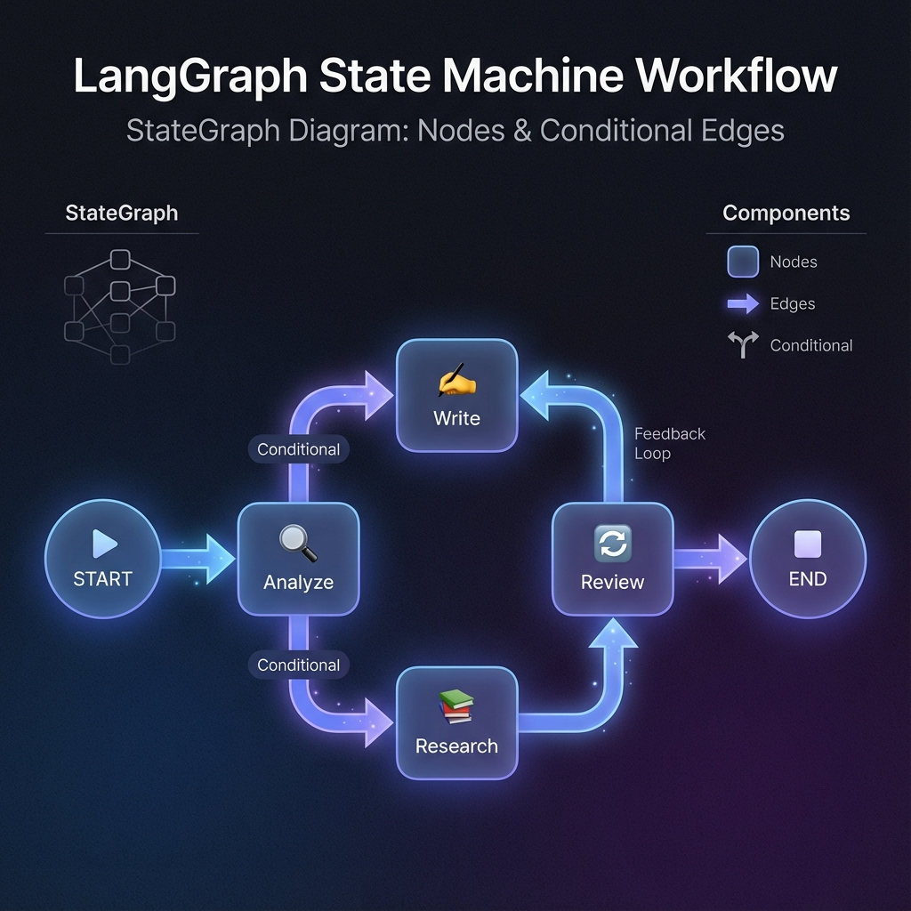

# Mengapa LangGraph?

LangChain chains bagus untuk workflows **linear**. Tapi real-world AI applications butuh lebih: **loops, branches, dan state management**.

## Limitasi Chains

```
Chain: A → B → C → D → Output

Problem:
- Tidak bisa loop kembali ke B
- Tidak bisa skip ke D based on condition
- Tidak ada state yang persist antar steps
```

### Contoh Problem

```python
# Ini TIDAK bisa dilakukan dengan chain biasa:
# 1. Generate draft
# 2. Review draft
# 3. IF review says "needs revision" → go back to step 1
# 4. ELSE → publish

# Chain selalu linear!
```

## LangGraph: State Machine untuk AI

LangGraph adalah library untuk membangun **stateful, multi-actor applications** dengan LLM.



### Konsep Utama

```
┌─────────────────────────────────────────────────────────────┐
│                      LangGraph                               │
├─────────────────────────────────────────────────────────────┤
│                                                              │
│   State ────▶ Node A ────▶ State' ────▶ Node B ────▶ ...    │
│                 │                         │                  │
│                 └──── Conditional ────────┘                  │
│                           Edge                               │
│                                                              │
│   Features:                                                  │
│   ✅ Cycles (loops)                                          │
│   ✅ Conditional branches                                    │
│   ✅ Persistent state                                        │
│   ✅ Human-in-the-loop                                       │
│   ✅ Checkpointing                                           │
│                                                              │
└─────────────────────────────────────────────────────────────┘
```

## When to Use LangGraph?

### ✅ Use LangGraph:

- **Multi-step workflows** dengan branching
- **Agent loops** (think → act → observe → repeat)  
- **Human approval** required in flow
- **Complex state** yang perlu di-track
- **Multi-agent** collaboration

### ❌ Stick with Chains:

- Simple **linear** pipelines
- Basic **RAG** (retrieve → generate)
- **Single-shot** LLM calls

## Installation

```bash
pip install langgraph
```

Verify:
```python
import langgraph
print(langgraph.__version__)
```

## First LangGraph Example

```python
from langgraph.graph import StateGraph, START, END
from typing import TypedDict

# 1. Define State
class State(TypedDict):
    messages: list[str]
    current_step: str

# 2. Define Nodes (functions that modify state)
def greet(state: State) -> State:
    state["messages"].append("Hello!")
    state["current_step"] = "greeted"
    return state

def ask_name(state: State) -> State:
    state["messages"].append("What's your name?")
    state["current_step"] = "asked_name"
    return state

def say_goodbye(state: State) -> State:
    state["messages"].append("Goodbye!")
    state["current_step"] = "finished"
    return state

# 3. Build Graph
builder = StateGraph(State)

# Add nodes
builder.add_node("greet", greet)
builder.add_node("ask_name", ask_name)
builder.add_node("goodbye", say_goodbye)

# Add edges
builder.add_edge(START, "greet")
builder.add_edge("greet", "ask_name")
builder.add_edge("ask_name", "goodbye")
builder.add_edge("goodbye", END)

# 4. Compile
graph = builder.compile()

# 5. Run
result = graph.invoke({
    "messages": [],
    "current_step": ""
})

print(result["messages"])
# ['Hello!', "What's your name?", 'Goodbye!']
```

## Comparison: Chain vs LangGraph

| Feature | Chain | LangGraph |
|---------|-------|-----------|
| Linear flow | ✅ | ✅ |
| Conditional branching | ❌ | ✅ |
| Cycles/loops | ❌ | ✅ |
| State persistence | ❌ | ✅ |
| Checkpointing | ❌ | ✅ |
| Human-in-loop | Limited | ✅ |
| Visual debugging | ❌ | ✅ (Studio) |

## LangGraph Components

### 1. State

Typed container untuk semua data dalam workflow.

```python
from typing import TypedDict, Annotated
from operator import add

class AgentState(TypedDict):
    messages: Annotated[list, add]  # Messages get appended
    next_action: str
```

### 2. Nodes

Functions yang memodifikasi state.

```python
def process_node(state: AgentState) -> dict:
    # Do something
    return {"messages": ["New message"]}
```

### 3. Edges

Connections between nodes (including conditional).

```python
# Normal edge
builder.add_edge("node_a", "node_b")

# Conditional edge
builder.add_conditional_edges(
    "node_a",
    routing_function,  # Returns next node name
    {"option1": "node_b", "option2": "node_c"}
)
```

### 4. Graph

The compiled workflow.

```python
graph = builder.compile()
result = graph.invoke(initial_state)
```

## Real Use Cases

1. **Content Pipeline**: Research → Write → Review → Revise (loop) → Publish
2. **Customer Support**: Classify → Route → Respond → Escalate (if needed)
3. **Code Review**: Analyze → Suggest → Apply → Test → Report
4. **Research Agent**: Plan → Search → Analyze → Synthesize → Verify

## Ringkasan

1. **Chains** bagus untuk linear pipelines
2. **LangGraph** untuk complex workflows dengan:
   - Loops
   - Branches
   - State management
   - Human approval
3. Core concepts: **State, Nodes, Edges, Graph**

---

**Selanjutnya:** [Konsep Inti](/docs/langgraph/core-concepts) - StateGraph, State, Nodes, dan Edges.
