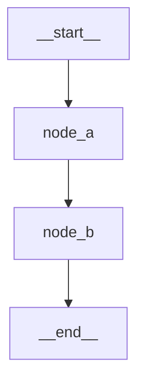

# LangGraph Studio

LangGraph Studio adalah **visual IDE** untuk developing dan debugging LangGraph applications.

## Overview

```
┌─────────────────────────────────────────────────────────────┐
│                   LangGraph Studio                           │
├─────────────────────────────────────────────────────────────┤
│                                                              │
│   ┌──────────────┐  ┌──────────────┐  ┌──────────────┐      │
│   │   Graph      │  │    State     │  │   Thread     │      │
│   │   Viewer     │  │   Inspector  │  │   History    │      │
│   └──────────────┘  └──────────────┘  └──────────────┘      │
│                                                              │
│   Features:                                                   │
│   ✅ Visual graph representation                             │
│   ✅ Step-by-step execution                                  │
│   ✅ State inspection at each node                           │
│   ✅ Time travel debugging                                   │
│   ✅ Edit and re-run                                         │
│                                                              │
└─────────────────────────────────────────────────────────────┘
```

## Installation

LangGraph Studio tersedia sebagai desktop app.

### Mac

```bash
# Download from
# https://studio.langchain.com
```

### Or via CLI

```bash
pip install langgraph-cli

# Start studio
langgraph dev
```

## Project Setup

Create `langgraph.json` di root project:

```json
{
  "graphs": {
    "my_agent": {
      "file": "src/agent.py",
      "variable": "graph"
    }
  },
  "env": ".env"
}
```

### Project Structure

```
my-project/
├── langgraph.json
├── .env
├── requirements.txt
└── src/
    └── agent.py
```

### agent.py

```python
from langgraph.graph import StateGraph, START, END
from typing import TypedDict

class State(TypedDict):
    messages: list

def node_a(state: State) -> dict:
    return {"messages": state["messages"] + ["Node A executed"]}

def node_b(state: State) -> dict:
    return {"messages": state["messages"] + ["Node B executed"]}

builder = StateGraph(State)
builder.add_node("node_a", node_a)
builder.add_node("node_b", node_b)
builder.add_edge(START, "node_a")
builder.add_edge("node_a", "node_b")
builder.add_edge("node_b", END)

# Export compiled graph
graph = builder.compile()
```

## Starting Studio

```bash
cd my-project
langgraph dev
```

This opens the Studio UI in your browser.

## Studio Features

### 1. Graph Visualization

See your graph structure visually:
- Nodes as boxes
- Edges as arrows
- Conditional edges with labels
- Current position highlighted

### 2. Interactive Execution

```
1. Enter input in the left panel
2. Click "Run" or step through
3. Watch state change at each node
4. Inspect intermediate states
```

### 3. State Inspector

View state at any point:

```json
{
  "messages": [
    {"type": "human", "content": "Hello"},
    {"type": "ai", "content": "Hi there!"}
  ],
  "current_step": "processed"
}
```

### 4. Thread Management

- Create new threads
- Switch between threads
- View thread history
- Resume interrupted threads

### 5. Time Travel

Go back to any previous state:

1. Click on history point
2. View state at that point
3. Modify state if needed
4. Re-run from that point

## Configuration Options

### langgraph.json

```json
{
  "graphs": {
    "agent": {
      "file": "src/agent.py",
      "variable": "compiled_graph"
    },
    "chatbot": {
      "file": "src/chatbot.py",
      "variable": "chat_graph"
    }
  },
  "env": ".env",
  "python_version": "3.11",
  "pip_config": {
    "extra_index_url": ["https://pypi.org/simple"]
  }
}
```

### Environment Variables

```bash
# .env
OPENAI_API_KEY=sk-...
LANGCHAIN_API_KEY=lsv2_...
LANGCHAIN_TRACING_V2=true
```

## Debugging Workflow

### 1. Test with Simple Input

```python
# Start simple
result = graph.invoke({"messages": ["Hello"]})
```

### 2. Add Breakpoints (Interrupts)

```python
graph = builder.compile(
    checkpointer=MemorySaver(),
    interrupt_before=["critical_node"]
)
```

### 3. Inspect State at Breakpoint

In Studio:
- See current state
- Modify values
- Continue or abort

### 4. View Full Trace

Click on any run to see:
- All nodes executed
- Time per node
- State changes
- Errors if any

## Best Practices

### 1. Meaningful Node Names

```python
# ✅ Good
builder.add_node("research_topic", research_fn)
builder.add_node("generate_outline", outline_fn)

# ❌ Bad
builder.add_node("n1", fn1)
builder.add_node("n2", fn2)
```

### 2. Descriptive State Keys

```python
# ✅ Good
class State(TypedDict):
    user_query: str
    research_results: list
    draft_content: str

# ❌ Bad
class State(TypedDict):
    q: str
    r: list
    d: str
```

### 3. Add Logging

```python
import logging
logging.basicConfig(level=logging.INFO)

def my_node(state: State) -> dict:
    logging.info(f"Processing: {state['input'][:50]}...")
    # ...
```

## Generating Graph Diagrams

Export for documentation:

```python
from IPython.display import Image

# Generate PNG
img = graph.get_graph().draw_mermaid_png()
with open("graph.png", "wb") as f:
    f.write(img)

# Or get Mermaid code
mermaid_code = graph.get_graph().draw_mermaid()
print(mermaid_code)
```

Output:


## Use Case Modul 8: Content Pipeline

```python
#!/usr/bin/env python3
"""
Content Creation Pipeline - Use Case Modul 8
Multi-agent system dengan human approval.
"""

from langgraph.graph import StateGraph, START, END
from langgraph.checkpoint.memory import MemorySaver
from langchain_openai import ChatOpenAI
from typing import TypedDict, Annotated, Literal
from operator import add

class ContentState(TypedDict):
    topic: str
    research: str
    draft: str
    feedback: Annotated[list[str], add]
    status: str
    approved: bool

llm = ChatOpenAI(model="gpt-4o-mini")

def brainstorm(state: ContentState) -> dict:
    response = llm.invoke(f"Brainstorm ideas for: {state['topic']}")
    return {"research": response.content, "status": "brainstormed"}

def write(state: ContentState) -> dict:
    context = state.get("research", "")
    feedback = state.get("feedback", [])
    
    prompt = f"Write about {state['topic']}. Context: {context}"
    if feedback:
        prompt += f"\nAddress this feedback: {feedback[-1]}"
    
    response = llm.invoke(prompt)
    return {"draft": response.content, "status": "written"}

def review(state: ContentState) -> dict:
    response = llm.invoke(f"Review:\n{state['draft']}")
    
    if "APPROVED" in response.content.upper():
        return {"status": "approved", "approved": True}
    
    return {
        "feedback": [response.content],
        "status": "needs_revision",
        "approved": False
    }

def publish(state: ContentState) -> dict:
    return {"status": "published", "draft": state["draft"] + "\n[PUBLISHED]"}

def route(state: ContentState) -> Literal["write", "publish", "__end__"]:
    if state.get("approved"):
        return "publish"
    if state["status"] == "needs_revision":
        return "write"
    return END

# Build
builder = StateGraph(ContentState)

builder.add_node("brainstorm", brainstorm)
builder.add_node("write", write)
builder.add_node("review", review)
builder.add_node("publish", publish)

builder.add_edge(START, "brainstorm")
builder.add_edge("brainstorm", "write")
builder.add_edge("write", "review")
builder.add_conditional_edges("review", route)
builder.add_edge("publish", END)

# Compile with checkpointing
graph = builder.compile(
    checkpointer=MemorySaver(),
    interrupt_before=["publish"]  # Human approval before publish
)

# Export for Studio
# Save this file as src/content_pipeline.py
# Add to langgraph.json: {"graphs": {"pipeline": {"file": "src/content_pipeline.py", "variable": "graph"}}}
```

## Ringkasan

1. **LangGraph Studio** - visual IDE for graphs
2. **langgraph.json** - project configuration
3. **Interactive execution** - step through nodes
4. **State inspection** - view data at any point
5. **Time travel** - debug past states
6. **Export diagrams** - document your graphs

---

**Selamat!** 🎉 Kamu sudah menyelesaikan **Modul 8: LangGraph**!

Kamu sekarang bisa:
- Membangun stateful workflows
- Implement loops dan conditional branches
- Add human-in-the-loop
- Create multi-agent systems
- Debug dengan LangGraph Studio

---

**Selanjutnya:** [Modul 9: Production](/docs/production/intro) - Deploy dan monitor aplikasi LangChain.
