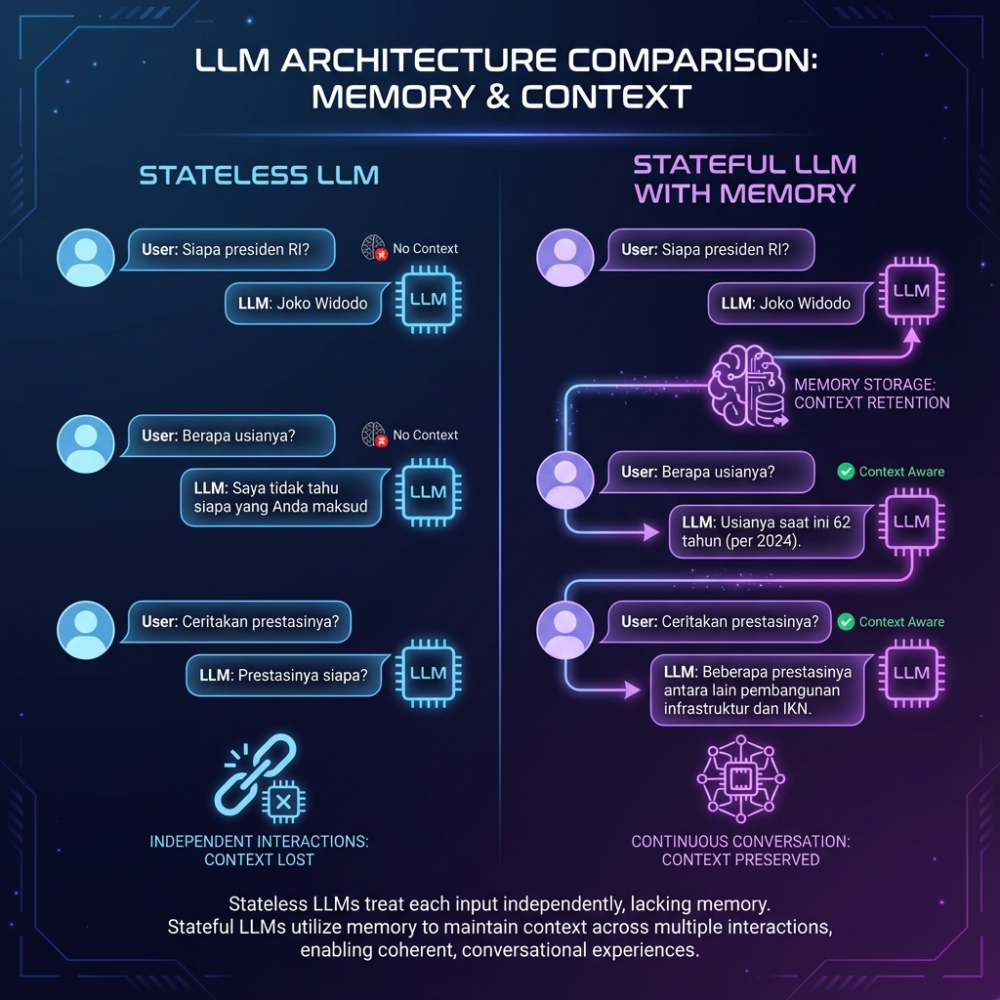

# Konsep Memory

LLM secara default adalah **stateless** - tidak mengingat percakapan sebelumnya. Modul ini membahas cara menambahkan "memory" agar chatbot bisa melanjutkan konteks.

## Masalah: LLM Stateless

Setiap kali kita memanggil LLM, itu adalah **request terpisah** tanpa koneksi ke request sebelumnya.



### Contoh Masalah

```python
from langchain_openai import ChatOpenAI

llm = ChatOpenAI(model="gpt-4o-mini")

# Request 1
response1 = llm.invoke("Siapa presiden Indonesia saat ini?")
print(response1.content)
# "Presiden Indonesia saat ini adalah Prabowo Subianto."

# Request 2 - LLM tidak tahu konteks sebelumnya!
response2 = llm.invoke("Berapa usianya?")
print(response2.content)
# "Maaf, saya tidak tahu siapa yang Anda maksud. 
#  Bisa jelaskan lebih lanjut?"
```

**Mengapa ini terjadi?**
- Setiap `invoke()` adalah HTTP request terpisah
- API tidak menyimpan state antar request
- LLM tidak tahu apa-apa tentang percakapan sebelumnya

## Solusi: Menyimpan Conversation History

Kita perlu **mengirim ulang** history percakapan di setiap request.

```python
from langchain_core.messages import HumanMessage, AIMessage

# Simpan history manual
history = []

# Request 1
history.append(HumanMessage(content="Siapa presiden Indonesia?"))
response1 = llm.invoke(history)
history.append(AIMessage(content=response1.content))

# Request 2 - kirim semua history
history.append(HumanMessage(content="Berapa usianya?"))
response2 = llm.invoke(history)  # Sekarang LLM tahu konteksnya!
print(response2.content)
# "Prabowo Subianto lahir pada 17 Oktober 1951, 
#  sehingga usianya saat ini adalah 73 tahun."
```

### Visualisasi Conversation Flow

```
┌─────────────────────────────────────────────────────────────┐
│                    Stateful Conversation                     │
├─────────────────────────────────────────────────────────────┤
│                                                              │
│  Request 1:                                                  │
│  ┌──────────────────┐                                       │
│  │ Human: "Siapa    │ ───▶ LLM ───▶ "Prabowo Subianto"     │
│  │ presiden RI?"    │                                       │
│  └──────────────────┘                                       │
│           │                                                  │
│           ▼ (save to memory)                                │
│  ┌──────────────────┐                                       │
│  │     MEMORY       │                                       │
│  │ H: Siapa presiden│                                       │
│  │ A: Prabowo...    │                                       │
│  └──────────────────┘                                       │
│           │                                                  │
│  Request 2:│                                                 │
│  ┌──────────────────┐                                       │
│  │ Human: "Berapa   │                                       │
│  │ usianya?"        │                                       │
│  └──────────────────┘                                       │
│           │                                                  │
│           ▼ (attach memory)                                 │
│  ┌──────────────────┐                                       │
│  │ H: Siapa presiden│                                       │
│  │ A: Prabowo...    │ ───▶ LLM ───▶ "73 tahun"             │
│  │ H: Berapa usia?  │                                       │
│  └──────────────────┘                                       │
│                                                              │
└─────────────────────────────────────────────────────────────┘
```

## Message Types di LangChain

LangChain menyediakan tipe message yang berbeda:

```python
from langchain_core.messages import (
    SystemMessage,    # Instruksi untuk AI
    HumanMessage,     # Input dari user
    AIMessage,        # Response dari AI
    ToolMessage,      # Hasil tool/function call
)

messages = [
    SystemMessage(content="Kamu adalah asisten yang ramah."),
    HumanMessage(content="Halo!"),
    AIMessage(content="Halo! Ada yang bisa saya bantu?"),
    HumanMessage(content="Siapa namamu?"),
]

response = llm.invoke(messages)
```

## Trade-offs: Context Length vs Cost

### Semakin Panjang History = Semakin Mahal

```python
# Conversation pendek (murah)
messages = [
    HumanMessage(content="Hi"),
    AIMessage(content="Hello!")
]
# ~10 tokens

# Conversation panjang (mahal)
messages = [
    HumanMessage(content="...panjang..."),
    AIMessage(content="...panjang..."),
    # ... 50 messages ...
]
# ~5000+ tokens = $$$
```

### Context Window Limit

Setiap model punya batas context:

| Model | Context Window |
|-------|----------------|
| gpt-4o-mini | 128K tokens |
| gpt-4o | 128K tokens |
| claude-3-haiku | 200K tokens |
| claude-3.5-sonnet | 200K tokens |
| llama-3.1-8b | 128K tokens |

### Strategi Mengelola History

1. **Keep All** - Simpan semua (simple, mahal)
2. **Window** - Simpan N messages terakhir
3. **Summary** - Rangkum percakapan lama
4. **Token Limit** - Potong sampai batas token

```python
# Window strategy - simpan 10 messages terakhir
def windowed_history(messages, window_size=10):
    if len(messages) > window_size:
        return messages[-window_size:]
    return messages
```

## Komponen Memory di LangChain

LangChain menyediakan abstractions untuk memory:

### 1. Message History (Storage)

```python
from langchain_community.chat_message_histories import ChatMessageHistory

# In-memory storage
history = ChatMessageHistory()

history.add_user_message("Hello")
history.add_ai_message("Hi there!")

print(history.messages)
# [HumanMessage(content='Hello'), AIMessage(content='Hi there!')]
```

### 2. RunnableWithMessageHistory (Integration)

```python
from langchain_core.runnables.history import RunnableWithMessageHistory

# Wrap chain dengan memory
chain_with_memory = RunnableWithMessageHistory(
    runnable=chain,
    get_session_history=get_session_history,
    input_messages_key="messages",
    history_messages_key="history"
)
```

### 3. Persistent Storage Options

```python
# Redis (production)
from langchain_community.chat_message_histories import RedisChatMessageHistory

# SQLite (local)
from langchain_community.chat_message_histories import SQLChatMessageHistory

# PostgreSQL
from langchain_community.chat_message_histories import PostgresChatMessageHistory
```

## Session Management

Setiap user/conversation butuh **session ID** yang unik.

```python
from uuid import uuid4

# Generate unique session ID per user
session_id = str(uuid4())

# Store mapping: user_id -> session_id
sessions = {
    "user_123": "abc-123-def",
    "user_456": "ghi-789-jkl"
}
```

## Ringkasan

1. **LLM stateless** by default - tidak ingat percakapan
2. **Solution**: Kirim history di setiap request
3. **Trade-off**: Longer history = more cost & tokens
4. **LangChain** provides memory abstractions
5. **Session management** untuk multi-user scenarios

---

**Selanjutnya:** [Message History](/docs/memory/message-history) - Cara menyimpan dan mengelola conversation history.
