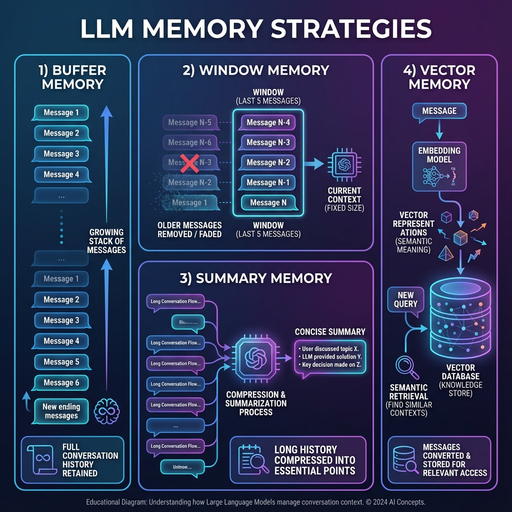

# Jenis-jenis Memory

Ada berbagai strategi untuk mengelola conversation history. Masing-masing memiliki trade-offs berbeda.

## Overview Memory Types



## 1. Buffer Memory (Keep All)

Simpan **semua messages** tanpa batasan.

### Karakteristik
- ✅ Simple, tidak kehilangan context
- ❌ Token usage terus bertambah
- ❌ Bisa hit context limit

### Implementation

```python
from langchain_community.chat_message_histories import ChatMessageHistory

# Buffer - simpan semua
buffer_history = ChatMessageHistory()

# Add messages - no limit
buffer_history.add_user_message("Message 1")
buffer_history.add_ai_message("Response 1")
buffer_history.add_user_message("Message 2")
buffer_history.add_ai_message("Response 2")
# ... continues forever

print(f"Total messages: {len(buffer_history.messages)}")
```

### When to Use
- Short conversations
- Testing/development
- When context is critical

## 2. Window Memory (Last N)

Simpan hanya **N messages terakhir**.

### Karakteristik
- ✅ Bounded token usage
- ✅ Predictable cost
- ❌ Loses old context

### Implementation

```python
from langchain_core.messages import trim_messages

def create_window_history(max_messages: int = 10):
    """Create windowed message history."""
    
    class WindowedHistory:
        def __init__(self):
            self.messages = []
            self.max_messages = max_messages
        
        def add_message(self, message):
            self.messages.append(message)
            # Trim if exceeds window
            if len(self.messages) > self.max_messages:
                self.messages = self.messages[-self.max_messages:]
        
        def add_user_message(self, content):
            from langchain_core.messages import HumanMessage
            self.add_message(HumanMessage(content=content))
        
        def add_ai_message(self, content):
            from langchain_core.messages import AIMessage
            self.add_message(AIMessage(content=content))
        
        def get_messages(self):
            return self.messages
        
        def clear(self):
            self.messages = []
    
    return WindowedHistory()

# Usage
history = create_window_history(max_messages=6)

# Add 10 messages
for i in range(5):
    history.add_user_message(f"User message {i+1}")
    history.add_ai_message(f"AI response {i+1}")

# Only last 6 remain
print(f"Messages kept: {len(history.get_messages())}")  # 6
```

### Using trim_messages

```python
from langchain_core.messages import trim_messages, HumanMessage, AIMessage

messages = [
    HumanMessage(content="Message 1"),
    AIMessage(content="Response 1"),
    HumanMessage(content="Message 2"),
    AIMessage(content="Response 2"),
    HumanMessage(content="Message 3"),
    AIMessage(content="Response 3"),
]

# Keep last 4 messages
trimmed = trim_messages(
    messages,
    max_tokens=4,
    token_counter=len,  # Count by number
    strategy="last",
    start_on="human",  # Start with human message
    include_system=True
)

print(len(trimmed))  # 4
```

### When to Use
- Long-running conversations
- Cost-sensitive applications
- When recent context is most important

## 3. Summary Memory

**Ringkas** percakapan lama menjadi summary.

### Karakteristik
- ✅ Retains key information
- ✅ Bounded tokens
- ❌ May lose details
- ❌ Requires LLM call for summarization

### Implementation

```python
from langchain_openai import ChatOpenAI
from langchain_core.prompts import ChatPromptTemplate
from langchain_core.messages import SystemMessage, HumanMessage, AIMessage

llm = ChatOpenAI(model="gpt-4o-mini", temperature=0)

class SummaryMemory:
    def __init__(self, summarize_threshold: int = 10):
        self.messages = []
        self.summary = ""
        self.summarize_threshold = summarize_threshold
    
    def add_message(self, message):
        self.messages.append(message)
        
        # Summarize when threshold reached
        if len(self.messages) >= self.summarize_threshold:
            self._summarize()
    
    def _summarize(self):
        # Create summary of old messages
        conversation = "\n".join([
            f"{'User' if isinstance(m, HumanMessage) else 'AI'}: {m.content}"
            for m in self.messages[:-2]  # Keep last 2
        ])
        
        prompt = ChatPromptTemplate.from_template("""
        Ringkas percakapan berikut menjadi 2-3 kalimat penting:
        
        {conversation}
        
        Ringkasan:
        """)
        
        chain = prompt | llm
        new_summary = chain.invoke({"conversation": conversation}).content
        
        # Update summary
        if self.summary:
            self.summary = f"{self.summary}\n{new_summary}"
        else:
            self.summary = new_summary
        
        # Keep only recent messages
        self.messages = self.messages[-2:]
    
    def get_context(self):
        """Get summary + recent messages."""
        context = []
        
        if self.summary:
            context.append(SystemMessage(
                content=f"Ringkasan percakapan sebelumnya:\n{self.summary}"
            ))
        
        context.extend(self.messages)
        return context

# Usage
memory = SummaryMemory(summarize_threshold=6)

# Simulate conversation
memory.add_message(HumanMessage(content="Halo, nama saya Andi"))
memory.add_message(AIMessage(content="Halo Andi! Salam kenal."))
memory.add_message(HumanMessage(content="Saya suka programming"))
memory.add_message(AIMessage(content="Wah, bahasa apa yang Anda suka?"))
memory.add_message(HumanMessage(content="Python dan JavaScript"))
memory.add_message(AIMessage(content="Pilihan bagus! Keduanya populer."))
# Trigger summarization...

context = memory.get_context()
print(f"Summary: {memory.summary}")
print(f"Recent messages: {len(memory.messages)}")
```

### When to Use
- Very long conversations
- When key facts matter more than exact wording
- Enterprise chatbots

## 4. Token Buffer Memory

Simpan messages sampai batas **token count**.

### Implementation

```python
import tiktoken

class TokenBufferMemory:
    def __init__(self, max_tokens: int = 2000, model: str = "gpt-4o-mini"):
        self.messages = []
        self.max_tokens = max_tokens
        self.encoding = tiktoken.encoding_for_model(model)
    
    def _count_tokens(self, messages):
        return sum(
            len(self.encoding.encode(m.content)) 
            for m in messages
        )
    
    def add_message(self, message):
        self.messages.append(message)
        
        # Trim oldest until under limit
        while (self._count_tokens(self.messages) > self.max_tokens 
               and len(self.messages) > 2):
            self.messages = self.messages[2:]  # Remove oldest pair
    
    def get_messages(self):
        return self.messages

# Usage
memory = TokenBufferMemory(max_tokens=500)
# Messages auto-trimmed to fit token budget
```

## 5. Vector Memory (Semantic Retrieval)

Simpan di vector store, retrieve yang **paling relevan**.

### Karakteristik
- ✅ Retrieves relevant context
- ✅ Works for very long histories
- ❌ May miss recent context
- ❌ Requires embedding + vector store

### Implementation

```python
from langchain_openai import OpenAIEmbeddings
from langchain_chroma import Chroma
from langchain_core.documents import Document

class VectorMemory:
    def __init__(self):
        self.embeddings = OpenAIEmbeddings()
        self.vectorstore = Chroma(
            collection_name="conversation_memory",
            embedding_function=self.embeddings
        )
        self.message_count = 0
    
    def add_messages(self, human_msg: str, ai_msg: str):
        """Add a conversation turn to memory."""
        self.message_count += 1
        
        # Store as document
        doc = Document(
            page_content=f"User: {human_msg}\nAssistant: {ai_msg}",
            metadata={
                "turn": self.message_count,
                "human": human_msg,
                "ai": ai_msg
            }
        )
        self.vectorstore.add_documents([doc])
    
    def get_relevant_history(self, query: str, k: int = 3):
        """Retrieve most relevant past conversations."""
        docs = self.vectorstore.similarity_search(query, k=k)
        return docs

# Usage
memory = VectorMemory()

# Add past conversations
memory.add_messages(
    "Apa itu machine learning?",
    "Machine learning adalah cabang AI yang..."
)
memory.add_messages(
    "Bagaimana cara install Python?",
    "Anda bisa download dari python.org..."
)
memory.add_messages(
    "Jelaskan tentang neural network",
    "Neural network terinspirasi dari otak manusia..."
)

# Query - finds relevant context
results = memory.get_relevant_history("Ceritakan tentang deep learning")
for doc in results:
    print(doc.page_content)
```

### When to Use
- Very long conversation histories
- When semantic relevance matters
- FAQ/knowledge retrieval scenarios

## Comparison Table

| Memory Type | Token Usage | Context Retention | Complexity | Best For |
|-------------|-------------|-------------------|------------|----------|
| Buffer | Grows | Complete | Low | Short chats |
| Window | Fixed | Recent only | Low | Long chats |
| Summary | Low | Key points | Medium | Enterprise |
| Token Buffer | Fixed | Flexible | Medium | API cost control |
| Vector | Variable | Semantic | High | Knowledge retrieval |

## Hybrid Approach

Kombinasi beberapa strategy:

```python
class HybridMemory:
    """Combine window + summary + vector memory."""
    
    def __init__(self):
        self.recent = []  # Window: last 6 messages
        self.summary = ""  # Summary of older
        self.vector_store = None  # For semantic search
    
    def get_context(self, query: str):
        context = []
        
        # 1. Add summary
        if self.summary:
            context.append(f"Previous summary: {self.summary}")
        
        # 2. Add relevant from vector store
        if self.vector_store:
            relevant = self.vector_store.similarity_search(query, k=2)
            for doc in relevant:
                context.append(f"Related: {doc.page_content}")
        
        # 3. Add recent messages
        context.extend(self.recent)
        
        return context
```

## Ringkasan

1. **Buffer** - simple, simpan semua
2. **Window** - simpan N terakhir
3. **Summary** - ringkas yang lama
4. **Token Buffer** - batas berdasarkan tokens
5. **Vector** - semantic retrieval
6. **Hybrid** - kombinasi terbaik

---

**Selanjutnya:** [Conversational RAG](/docs/memory/conversational-rag) - Menggabungkan memory dengan RAG.
