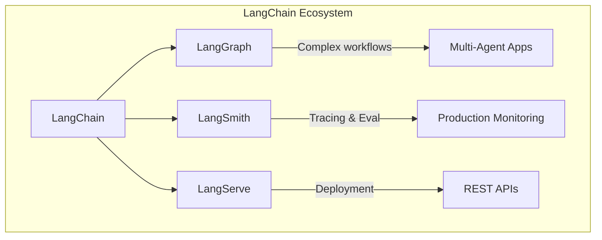

# Mengapa LangChain?

Setelah memahami apa itu LLM, pertanyaan selanjutnya adalah: **mengapa kita butuh LangChain?** Bukankah kita bisa langsung memanggil API OpenAI atau Anthropic?

Jawabannya: **bisa**, tapi LangChain membuat hidup kita jauh lebih mudah.

## Masalah yang Diselesaikan LangChain

### 1. 🔌 Abstraksi Provider

**Masalah:** Setiap LLM provider memiliki API yang berbeda.

```python
# Tanpa LangChain - harus tulis kode berbeda untuk setiap provider

# OpenAI
from openai import OpenAI
client = OpenAI()
response = client.chat.completions.create(
    model="gpt-4",
    messages=[{"role": "user", "content": "Hello"}]
)

# Anthropic
import anthropic
client = anthropic.Anthropic()
response = client.messages.create(
    model="claude-3-opus-20240229",
    messages=[{"role": "user", "content": "Hello"}]
)
```

```python
# Dengan LangChain - interface yang sama!

from langchain_openai import ChatOpenAI
from langchain_anthropic import ChatAnthropic

# Ganti provider = ganti 1 baris
llm = ChatOpenAI(model="gpt-4")
# llm = ChatAnthropic(model="claude-3-opus-20240229")

response = llm.invoke("Hello")
```

**Benefit:**
- Mudah switch antar provider
- Code yang konsisten
- Tidak perlu belajar API baru setiap provider

---

### 2. 🧩 Composability

**Masalah:** Membangun pipeline AI yang kompleks membutuhkan banyak "glue code".

```python
# Tanpa LangChain - manual piping

prompt = f"Translate this to French: {user_input}"
response = call_llm(prompt)
parsed = parse_json(response)
validated = validate_schema(parsed)
saved = save_to_db(validated)
```

```python
# Dengan LangChain LCEL - deklaratif dan clean

from langchain_core.prompts import ChatPromptTemplate
from langchain_core.output_parsers import JsonOutputParser

chain = (
    ChatPromptTemplate.from_template("Translate to French: {input}")
    | ChatOpenAI()
    | JsonOutputParser()
    | save_to_db  # custom function
)

result = chain.invoke({"input": user_input})
```

**Benefit:**
- Kode lebih readable
- Mudah di-debug dan di-test
- Reusable components

---

### 3. 📚 RAG Made Easy

**Masalah:** Menghubungkan LLM dengan dokumen eksternal itu kompleks.

```python
# Tanpa LangChain - harus implement sendiri:
# 1. Load dokumen
# 2. Split jadi chunks
# 3. Generate embeddings
# 4. Simpan di vector store
# 5. Query dan retrieve
# 6. Compose prompt dengan context
# 7. Call LLM
# ... ratusan baris kode
```

```python
# Dengan LangChain - abstraksi yang elegant

from langchain_community.document_loaders import PyPDFLoader
from langchain_text_splitters import RecursiveCharacterTextSplitter
from langchain_openai import OpenAIEmbeddings
from langchain_chroma import Chroma
from langchain.chains import create_retrieval_chain

# Load & process
docs = PyPDFLoader("doc.pdf").load()
splits = RecursiveCharacterTextSplitter().split_documents(docs)

# Create vector store
vectorstore = Chroma.from_documents(splits, OpenAIEmbeddings())

# Create RAG chain
rag_chain = create_retrieval_chain(vectorstore.as_retriever(), llm)
```

---

### 4. 🛠️ Tool Calling & Agents

**Masalah:** Membuat LLM bisa menggunakan tools membutuhkan infrastructure yang rumit.

```python
# Dengan LangChain - tools jadi mudah

from langchain.tools import tool
from langchain.agents import create_tool_calling_agent, AgentExecutor

@tool
def get_weather(city: str) -> str:
    """Get weather for a city."""
    return call_weather_api(city)

@tool
def search_web(query: str) -> str:
    """Search the web."""
    return call_search_api(query)

# Create agent dengan tools
agent = create_tool_calling_agent(llm, [get_weather, search_web], prompt)
executor = AgentExecutor(agent=agent, tools=[get_weather, search_web])

result = executor.invoke({"input": "What's the weather in Jakarta?"})
```

---

### 5. 🔄 Streaming & Async Out-of-the-Box

**Masalah:** Implementasi streaming dan async membutuhkan boilerplate code.

```python
# LangChain - streaming dan async gratis!

# Streaming
for chunk in chain.stream({"input": "Tell me a story"}):
    print(chunk, end="")

# Async
result = await chain.ainvoke({"input": "Hello"})

# Batch processing
results = chain.batch([{"input": "A"}, {"input": "B"}, {"input": "C"}])
```

---

## Kapan Pakai LangChain vs Langsung API?

### ✅ Gunakan LangChain jika:

| Kondisi | Alasan |
|---------|--------|
| Proyek kompleks dengan banyak komponen | Composability & maintainability |
| Perlu switch antar LLM provider | Abstraksi provider |
| Membangun RAG atau chatbot | Built-in tools |
| Butuh agents dengan tools | Agent framework |
| Tim dengan berbagai skill level | Learning curve lebih rendah |
| Butuh observability (LangSmith) | Integrated tracing |

### ❌ Langsung API jika:

| Kondisi | Alasan |
|---------|--------|
| Proyek sederhana (1-2 API call) | Overhead tidak worth it |
| Butuh kontrol maksimal | LangChain adalah abstraksi |
| Optimasi performa ekstrem | Setiap layer = latency |
| Sudah punya infrastructure sendiri | Tidak perlu duplikasi |

## Arsitektur LangChain

LangChain terdiri dari beberapa package:

```
┌─────────────────────────────────────────────────────────────┐
│                      Your Application                        │
├─────────────────────────────────────────────────────────────┤
│  langchain              │  langgraph                        │
│  (Chains, Agents,       │  (State machines,                 │
│   RAG, etc.)            │   Multi-agent systems)            │
├─────────────────────────┴───────────────────────────────────┤
│                     langchain-core                           │
│           (LCEL, Runnables, Base interfaces)                 │
├─────────────────────────────────────────────────────────────┤
│  langchain-openai  │ langchain-anthropic │ langchain-...    │
│  (Provider-specific integrations)                            │
├─────────────────────────────────────────────────────────────┤
│                   langchain-community                        │
│           (Vector stores, Document loaders, etc.)            │
└─────────────────────────────────────────────────────────────┘
```

### Package Breakdown

| Package | Fungsi | Install |
|---------|--------|---------|
| `langchain-core` | Base interfaces, LCEL | Termasuk di langchain |
| `langchain` | Chains, memory, agents | `pip install langchain` |
| `langchain-openai` | OpenAI integration | `pip install langchain-openai` |
| `langchain-anthropic` | Anthropic integration | `pip install langchain-anthropic` |
| `langchain-community` | Community integrations | `pip install langchain-community` |
| `langgraph` | State machines, multi-agent | `pip install langgraph` |
| `langsmith` | Observability, tracing | `pip install langsmith` |

## Ekosistem LangChain



| Tool | Fungsi |
|------|--------|
| **LangChain** | Core framework untuk building chains |
| **LangGraph** | State machines untuk workflow kompleks |
| **LangSmith** | Observability, tracing, evaluation |
| **LangServe** | Deploy chains sebagai REST API |

## Quick Comparison

| Aspek | Langsung API | LangChain |
|-------|--------------|-----------|
| Learning curve | Rendah | Medium |
| Flexibility | Maksimal | Terbatas oleh abstraksi |
| Development speed | Lambat untuk proyek besar | Cepat |
| Maintenance | Bisa jadi kompleks | Terstruktur |
| Community | Per-provider | Satu ekosistem |
| Documentation | Per-provider | Centralized |

## Ringkasan

LangChain menyelesaikan masalah:
1. **Abstraksi provider** - satu interface untuk semua LLM
2. **Composability** - membangun pipeline dengan mudah
3. **RAG** - menghubungkan LLM dengan data eksternal
4. **Agents** - membuat LLM bisa menggunakan tools
5. **Streaming/Async** - out of the box

**Gunakan LangChain** untuk proyek kompleks yang butuh maintainability.

**Gunakan API langsung** untuk proyek sederhana yang butuh kontrol maksimal.

---

**Selanjutnya:** [Setup Environment](/docs/prasyarat/setup-environment) - Kita akan menyiapkan environment Python untuk development.
