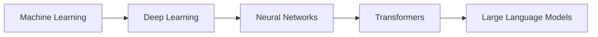

# Pengantar Generative AI

Sebelum menyelam ke LangChain, penting untuk memahami landscape teknologi AI yang mendasarinya. Bab ini akan memberikan konteks tentang bagaimana kita sampai di era Large Language Models (LLM).

## Evolusi AI: Dari ML ke LLM



### 1. Machine Learning (ML)

Machine Learning adalah cabang AI yang memungkinkan komputer "belajar" dari data tanpa diprogram secara eksplisit.

**Contoh klasik:**
- Spam filter email
- Rekomendasi Netflix/Spotify
- Fraud detection di bank

### 2. Deep Learning

Deep Learning menggunakan neural networks dengan banyak layer untuk menangkap pola yang lebih kompleks.

**Breakthrough:**
- Image recognition (ImageNet 2012)
- Speech recognition
- AlphaGo (2016)

### 3. Transformers (2017)

Paper "[Attention is All You Need](https://arxiv.org/abs/1706.03762)" memperkenalkan arsitektur Transformer yang revolusioner.

**Kunci inovasi:**
- **Self-attention mechanism** - memungkinkan model memahami konteks
- **Parallelization** - training lebih cepat
- **Scalability** - bisa dilatih dengan data sangat besar

### 4. Large Language Models (LLM)

LLM adalah model bahasa dengan miliaran parameter yang dilatih dengan data teks sangat besar.

| Model | Perusahaan | Parameter | Tahun |
|-------|-----------|-----------|-------|
| GPT-3 | OpenAI | 175B | 2020 |
| GPT-4 | OpenAI | ~1.7T (estimated) | 2023 |
| Claude 3 | Anthropic | Unknown | 2024 |
| Llama 2 | Meta | 70B | 2023 |
| Gemini | Google | Unknown | 2023 |

## Apa itu Large Language Model?

LLM adalah model AI yang:

1. **Memahami bahasa natural** - bisa memproses input dalam bahasa manusia
2. **Menghasilkan teks** - output berupa teks yang koheren dan kontekstual
3. **General purpose** - bisa melakukan berbagai tugas tanpa training khusus
4. **Pre-trained** - sudah dilatih dengan data internet skala besar

### Bagaimana LLM Bekerja?

```
Input: "Ibukota Indonesia adalah"
         ↓
    [LLM Processing]
    - Tokenization
    - Embedding
    - Attention layers
    - Output generation
         ↓
Output: "Jakarta"
```

LLM bekerja dengan memprediksi token (kata/subkata) berikutnya berdasarkan konteks sebelumnya. Ini disebut **autoregressive generation**.

## Pemain Utama di Ekosistem LLM

### 🔵 OpenAI

**Model:** GPT-3.5, GPT-4, GPT-4 Turbo

**Kelebihan:**
- Model paling capable saat ini
- API yang mudah digunakan
- Dokumentasi lengkap

**Kekurangan:**
- Berbayar (tidak ada tier gratis untuk produksi)
- Tidak open source
- Data privacy concerns

### 🟣 Anthropic

**Model:** Claude 2, Claude 3 (Haiku, Sonnet, Opus)

**Kelebihan:**
- Context window sangat besar (200K tokens)
- Focus on safety dan helpfulness
- Competitive dengan GPT-4

**Kekurangan:**
- API availability terbatas di beberapa region
- Lebih mahal dari GPT untuk volume tinggi

### 🔴 Google

**Model:** Gemini (Nano, Pro, Ultra), PaLM 2

**Kelebihan:**
- Multimodal native
- Integrasi dengan Google Cloud
- Competitive pricing

**Kekurangan:**
- API masih relatif baru
- Dokumentasi kurang lengkap dibanding OpenAI

### 🟠 Open Source

**Model:** Llama 2/3, Mistral, Mixtral, Qwen

**Kelebihan:**
- Gratis (bisa self-host)
- Data privacy terjamin
- Customizable

**Kekurangan:**
- Butuh infrastructure sendiri
- Performa di bawah model proprietary
- Butuh expertise untuk deployment

## Kapabilitas Modern LLM

LLM modern bisa melakukan banyak hal:

| Kapabilitas | Contoh |
|-------------|--------|
| **Text Generation** | Menulis artikel, email, code |
| **Summarization** | Meringkas dokumen panjang |
| **Translation** | Terjemahan multi-bahasa |
| **Question Answering** | Menjawab pertanyaan |
| **Code Generation** | Menulis dan debug code |
| **Reasoning** | Chain-of-thought problem solving |
| **Tool Use** | Menggunakan API eksternal |

## Limitasi LLM

Penting untuk memahami keterbatasan LLM:

:::warning Hallucination
LLM bisa menghasilkan informasi yang terdengar benar tapi sebenarnya salah. Ini disebut **hallucination**.
:::

:::warning Knowledge Cutoff
LLM memiliki "knowledge cutoff" - tidak tahu informasi setelah tanggal training tertentu.
:::

:::warning Context Window
LLM memiliki batas berapa banyak teks yang bisa diproses sekaligus (context window).
:::

## Mengapa Ini Penting untuk LangChain?

LangChain adalah framework yang membantu kita:

1. **Mengatasi limitasi LLM** - dengan RAG, tools, memory
2. **Menyederhanakan integrasi** - abstraksi untuk berbagai provider
3. **Membangun aplikasi kompleks** - chains, agents, workflows

Di bab-bab selanjutnya, kita akan melihat bagaimana LangChain memecahkan masalah-masalah ini.

## Ringkasan

- AI telah berevolusi dari ML klasik → Deep Learning → Transformers → LLM
- LLM adalah model bahasa berskala besar yang bisa memahami dan menghasilkan teks
- Ada berbagai provider: OpenAI, Anthropic, Google, dan open source
- LLM memiliki kemampuan luar biasa tapi juga keterbatasan
- LangChain hadir untuk membantu membangun aplikasi AI yang lebih powerful

---

**Selanjutnya:** [Mengapa LangChain?](/docs/prasyarat/mengapa-langchain) - Kita akan membahas masalah spesifik yang diselesaikan LangChain.
